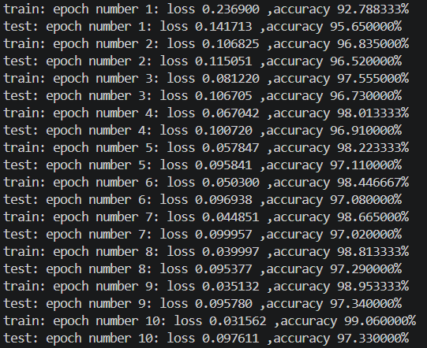

# MNIST Neural Network in C

C言語でニューラルネットワークを実装し、MNIST手書き数字データセットを用いた数字認識を行うプロジェクトです。

ニューラルネットワークの内部処理を理解することを目的として、機械学習ライブラリに依存せず、順伝播・誤差逆伝播・パラメータ更新などの主要な処理をC言語で実装しました。

## 概要

MNISTの28×28ピクセルの画像を入力として、0～9の10種類の数字を分類します。

ネットワークは以下の構成になっています。

```text
784
 ↓
Fully Connected
 ↓
50
 ↓
ReLU
 ↓
Fully Connected
 ↓
100
 ↓
ReLU
 ↓
Fully Connected
 ↓
10
 ↓
Softmax
 ↓
0～9の分類結果
```

## 実装内容

以下の処理をC言語で実装しています。

* 全結合層（Fully Connected Layer）
* ReLU
* Softmax
* 交差エントロピー誤差
* 誤差逆伝播法（Backpropagation）
* ミニバッチ学習
* パラメータのシャッフル
* He初期化
* Adamによるパラメータ更新
* 学習済みパラメータの保存
* 学習済みモデルを使用した推論

### 順伝播

入力画像を784次元のベクトルとして、

```text
784 → 50 → 100 → 10
```

の順に全結合層を通過させます。

隠れ層ではReLUを使用し、出力層ではSoftmaxによって各数字に対する確率を計算します。`inference.c` では最も確率の高いクラスを0～9の推論結果として出力します。

### 誤差逆伝播

出力層から入力側へ勾配を逆伝播させ、各全結合層の重みとバイアスに対する勾配を計算しています。

Softmaxと交差エントロピー誤差を組み合わせた勾配、ReLUの勾配、全結合層の勾配をそれぞれ実装しています。

### Adam

計算したミニバッチの平均勾配を使用してAdamによるパラメータ更新を行っています。

Adamでは一次モーメントと二次モーメントを保持し、バイアス補正を行ったうえでパラメータを更新しています。

現在の設定では、

```text
Learning rate: 0.005
β1: 0.9
β2: 0.999
ε: 1e-8
```

としています。

## 学習設定

現在の実装では以下の設定で学習を行っています。

| 項目            | 設定         |
| ------------- | ---------- |
| 入力サイズ         | 784        |
| 隠れ層1          | 50         |
| 隠れ層2          | 100        |
| 出力サイズ         | 10         |
| 活性化関数         | ReLU       |
| 出力層           | Softmax    |
| 損失関数          | 交差エントロピー誤差 |
| Optimizer     | Adam       |
| Learning Rate | 0.005      |
| Batch Size    | 100        |
| Epochs        | 10         |
| 重み初期化         | He初期化      |

学習中は各epochについて、学習データとテストデータそれぞれの損失と正解率を計算して表示します。

## ファイル構成

```text
MNIST/
├── README.md
├── training.c
├── inference.c
├── mnistload.h
├── results/
│   └── ...
└── .gitignore
```

### `training.c`

MNISTデータを読み込み、ニューラルネットワークの学習を行います。

学習後には各全結合層の重みとバイアスを `.dat` ファイルとして保存します。

### `inference.c`

学習済みパラメータを読み込み、指定したBMP画像に対して推論を行います。

使用方法：

```bash
./inference input.bmp
```

推論結果として、0～9の数字を出力します。

### `mnistload.h`

MNISTデータセットの読み込みや、BMP画像から推論用データを取得する処理などをまとめています。

## 実行方法

### 1. 学習

GCCなどのCコンパイラを使用してコンパイルします。

```bash
gcc training.c -o training -lm
```

その後、

```bash
./training
```

を実行すると学習が開始されます。

学習が終了すると、学習済みパラメータが保存されます。

```text
fc1_parameter_adam.dat
fc2_parameter_adam.dat
fc3_parameter_adam.dat
```

### 2. 推論

推論プログラムをコンパイルします。

```bash
gcc inference.c -o inference -lm
```

BMP画像を指定して実行します。

```bash
./inference input.bmp
```

例えば、

```text
inference answer: 7
```

のように推論結果が表示されます。

## 学習結果

以下は、学習中の損失(loss)と精度(accuracy)の推移です。



最終的な精度は97.33%となりました。


## 工夫した点

### 機械学習ライブラリを使用しない実装

ニューラルネットワークの仕組みを理解するため、既存の機械学習ライブラリに依存せず、C言語で主要な処理を実装しました。

### 誤差逆伝播の実装

各層について勾配を計算し、出力層から入力層に向かって誤差を伝播させています。

### Adamの実装

単純な勾配降下法ではなくAdamを実装し、一次モーメント・二次モーメントおよびバイアス補正を用いたパラメータ更新を行っています。

### 学習と推論の分離

`training.c` と `inference.c` を分離し、学習済みパラメータを保存して、学習を行わずに別のBMP画像を推論できる構成にしています。

## 今後の改善

* 学習結果の可視化
* ネットワーク構造の変更による精度比較
* AdamとSGDなどのOptimizerの比較
* 推論結果の可視化
* メモリ使用量・実行速度の改善
* より汎用的な画像入力への対応

## 使用技術

* C
* GCC
* MNIST
* VS Code
* Adam
* Backpropagation
* ReLU
* Softmax
